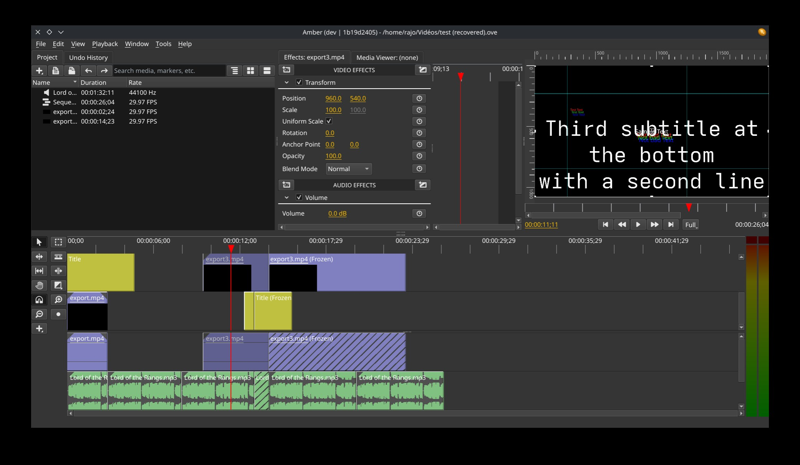

# Amber Video Editor

Fork of [Olive Video Editor](https://github.com/olive-editor/olive) `0.1.x`, ported to **Qt 6** and **FFmpeg 7/8**.

> **DISCLAIMER: AI-MAINTAINED CODE**
>
> The original Olive 0.1 codebase is hand-written (circa 2019, well before ChatGPT was a thing). This fork is vibe-coded: porting, bug fixes, and new features are all done with AI assistance (Claude Code). I don't have the C++ chops to maintain this myself, and no one else was picking it up, so here we are.



## What changed from Olive 0.1

- Qt 5 → Qt 6 (including Wayland compositing fix)
- FFmpeg 3.x → FFmpeg 7/8 API (deprecated calls replaced, compat guards for 3.4–8)
- `QLatin1String` wrappers for Qt 6.4 compatibility (Debian/Ubuntu)
- Windows cross-compilation via Fedora mingw64
- Hardware-accelerated video decoding (VAAPI on Linux, D3D11VA on Windows, VideoToolbox on macOS)
- GPU YUV→RGB conversion via OpenGL shader (bypasses CPU format conversion for YUV420P/NV12 frames)
- AppImage uses Qt 6.10 (native PipeWire audio backend) via aqtinstall; Ubuntu .deb stays on system Qt 6.4
- OpenGL fixed-function pipeline eliminated (VBO + explicit shaders + CPU matrices; prepares for future RHI migration)
- Various bug fixes (first-export audio corruption, race conditions, null pointers, memory leaks, Frei0r init, phantom audio on pause, waveform crash, VU meter thread safety, …)

## Roadmap

See [ROADMAP.md](ROADMAP.md) for planned versions (1.2 RHI port → 2.0 GPU-native effects). Previous versions stay supported.

## Packages

Pre-built packages for Windows, Linux (AppImage, Ubuntu .deb) and macOS are available on the [Releases](https://github.com/baptisterajaut/amber/releases) page. Arch Linux users: see the AUR. Tested on Arch Linux only; other builds are best-effort.

Build scripts in `packaging/linux/` (Dockerfiles, PKGBUILD) and `packaging/windows/` (cross-compile Dockerfile, NSIS).

## Build (Linux)

```bash
cmake -S src -B build -DCMAKE_BUILD_TYPE=Release
cmake --build build -j$(nproc)
```

**Dependencies:** Qt 6 (Core, Gui, Widgets, Multimedia, OpenGL, OpenGLWidgets, Svg, LinguistTools), FFmpeg 3.4–8 (avutil, avcodec, avformat, avfilter, swscale, swresample), OpenGL.

## Build (Docker)

```bash
# Ubuntu 24.04 .deb
docker buildx build -f packaging/linux/ubuntu.dockerfile --output type=local,dest=./out .

# AppImage (Qt 6.10 + PipeWire audio)
docker buildx build -f packaging/linux/appimage.dockerfile --output type=local,dest=./out .

# Debian 12 .deb
docker buildx build -f packaging/linux/debian.dockerfile --target package --output type=local,dest=./out .

# Windows NSIS installer (cross-compiled from Fedora)
docker build -f packaging/windows/cross-compile.dockerfile --target package -t amber-win64 .
docker run --rm amber-win64 cat /out/amber-setup.exe > amber-setup.exe
```

## Build (macOS)

```bash
brew install qt@6 ffmpeg cmake
export CMAKE_PREFIX_PATH="$(brew --prefix qt@6);$(brew --prefix ffmpeg)"
cmake -S src -B build -DCMAKE_BUILD_TYPE=Release -DCMAKE_PREFIX_PATH="$CMAKE_PREFIX_PATH"
cmake --build build -j$(sysctl -n hw.ncpu)
```

To create an app bundle: `macdeployqt build/Amber.app`

## Build (Arch Linux)

```bash
cd packaging/linux
makepkg -si
```

## Upstream

Based on [olive-editor/olive](https://github.com/olive-editor/olive) by [MattKC](https://github.com/itsmattkc) and the Olive Team. Licensed under GPLv3.
